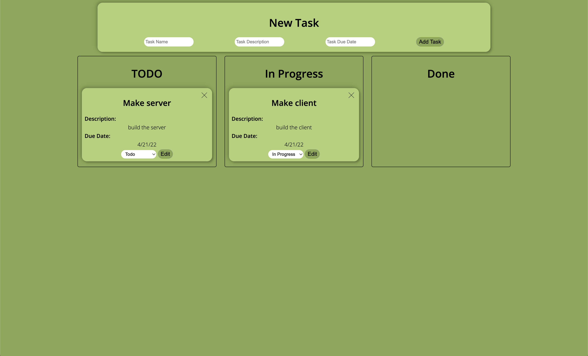

# Yodello

This is a Trello clone I created to learn about websockets. It features basic stacks for todo, in progress, and completed tasks. Each task has a title, description, and date to fill out. Tasks can be edited, deleted, or moved to a different stack. Any client that connects to the site will be able to see and make changes in real time. This was a really fun project to work on because I've never used anything like websockets before.

